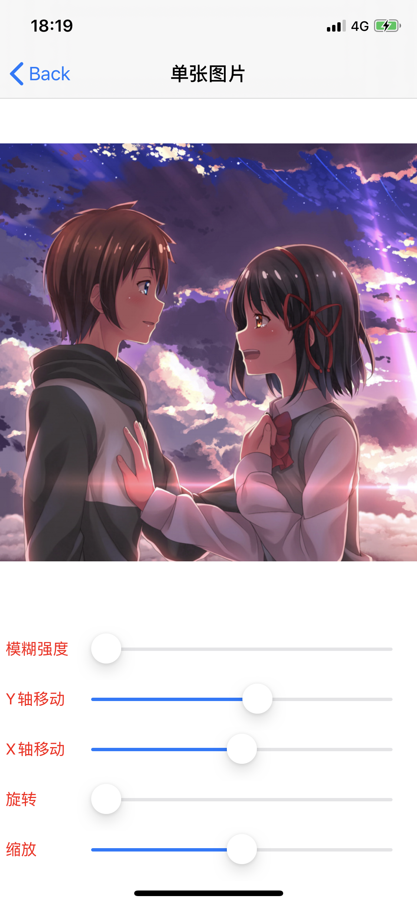
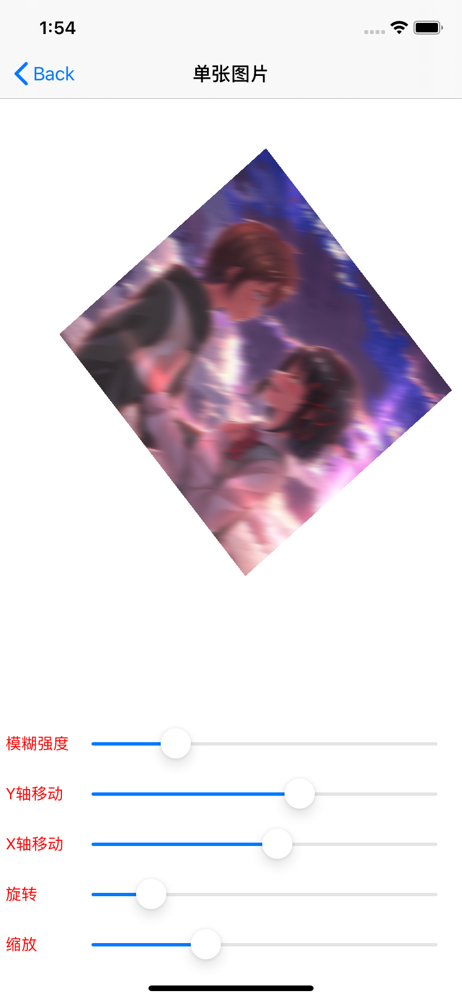

# OpenGL_3.0

## 介绍

本工程完全采用OpenGL ES 3.0的API进行实现，目的是更好的使用OpenGL相关功能并移植到移动端项目。

以示例为主，可以作为调参工具，也可以作为学习参考。

## 图片显示

* 将需要显示的图片转成纹理
* 纹理序号将会在渲染线程中传给GPU进行缓存
* OpenGL程序绘制纹理并光栅化显示到窗口

```
// 图片指定存储路径
NSString *imagePath = [[NSBundle mainBundle] pathForResource:@"yourname" ofType:@"png"];
// 转换图片为OpenGL纹理ID
GLKTextureInfo *textureInfo = [GLKTextureLoader textureWithContentsOfFile:imagePath options:@{GLKTextureLoaderOriginBottomLeft : @true, GLKTextureLoaderGenerateMipmaps : @true} error:NULL];
// 存储纹理
self.mTextureId = textureInfo.name;
// 纹理尺寸
_imageSize = CGSizeMake(textureInfo.width, textureInfo.height);
```

**图例一**

<div align=left></div>

<div align=left></div>

## 动画

* 通过绘制两张不同的图像
* 在切换图像过程中，编写shader，添加一些行为（如：旋转、渐变、缩放、移动等）
* 按指定帧率渲染每一帧图像，得到流畅的动画


**图例二**

<div align=left></div>


* 多张图片绘制时，可能需要修改透明度(需要开启混合模式, 会占用一定资源)
* 将时间作为参数传入shader，用于控制显示时长及效果
* 绘制第二张图片到窗口，用于替代第一张图，实现转场效果

> 绘制第一张图像，
> 如果在后台绘制，需要使用FBO机制，此处暂时不做讲解

```
- (void)glkView:(GLKView *)view drawInRect:(CGRect)rect {

    // 清理颜色缓冲区，防止渲染花屏不同步导致撕裂等问题
    glClearColor(1.0, 1.0, 1.0, 1.0);
    glClear(GL_COLOR_BUFFER_BIT);
    
    // 自定义参数传入
    glUniform2f(uniforms[UNIFORM_PIXEL_SIZE],      _imageSize.width, _imageSize.height);
    glUniform1f(uniforms[UNIFORM_ZOOM],            _zoom);
    glUniform1f(uniforms[UNIFORM_ANGLE_X],         (_rotationAngle * M_PI) / 180.0);
    glUniform1f(uniforms[UNIFORM_ANGLE_Y],         (_verticalRotationAngle * M_PI) / 180.0);
    glUniform2f(uniforms[UNIFORM_OFFSET],          _offsetPoint.x, _offsetPoint.y);

    // 激活纹理标号绑定到当前纹理ID，会将当前纹理对象传入shader中的inputImageTexture，此处使用的是2D图像，只包含x、y轴
    if (_mTextureId) {
        glActiveTexture(GL_TEXTURE2);
        glBindTexture(GL_TEXTURE_2D, _mTextureId);
        glUniform1i(_textureUniform, 2);
    }
    
    // 进行等比例裁剪显示，防止图像填充到屏幕出现拉伸现象
    [self cropTextureCoordinateForRect:rect];

    // 传入VAO数据，用于显示指定的顶点坐标以及纹素数据提取位置信息
    glVertexAttribPointer(_positionAttribute, 2, GL_FLOAT, 0, 0, _texturePosition);
    glVertexAttribPointer(_coordinateAttibute, 2, GL_FLOAT, 0, 0, textureCoordinates);
    
    // 同步绘制
    glDrawArrays(GL_TRIANGLE_STRIP, 0, 4);
    
    [self redrawTexture];
}
```

> 绘制第二张图
> 为了保证alpha通道不受第一张图的影响，需要开启混合模式

```
- (void)redrawTexture
{
    glEnable(GL_BLEND);
    glBlendFunc(GL_SRC_ALPHA, GL_ONE_MINUS_SRC_ALPHA);
    timeElapsed += [[NSString stringWithFormat:@"%f", self.timeSinceLastDraw] doubleValue];
    glUniform1f(_timeUniform, timeElapsed);
    glUniform1f(_chatrletUniform, 1.0);
    if (_textureId)
    {
         glActiveTexture(GL_TEXTURE3);
         glBindTexture(GL_TEXTURE_2D, _textureId);
         glUniform1i(_textureUniform, 3);
    }
    glDrawArrays(GL_TRIANGLE_STRIP, 0, 4);
    glDisable(GL_BLEND);
}
```
